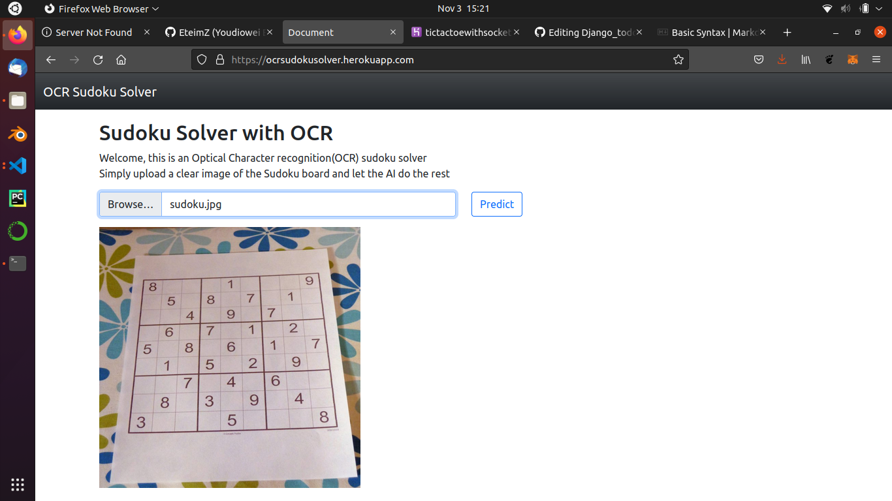
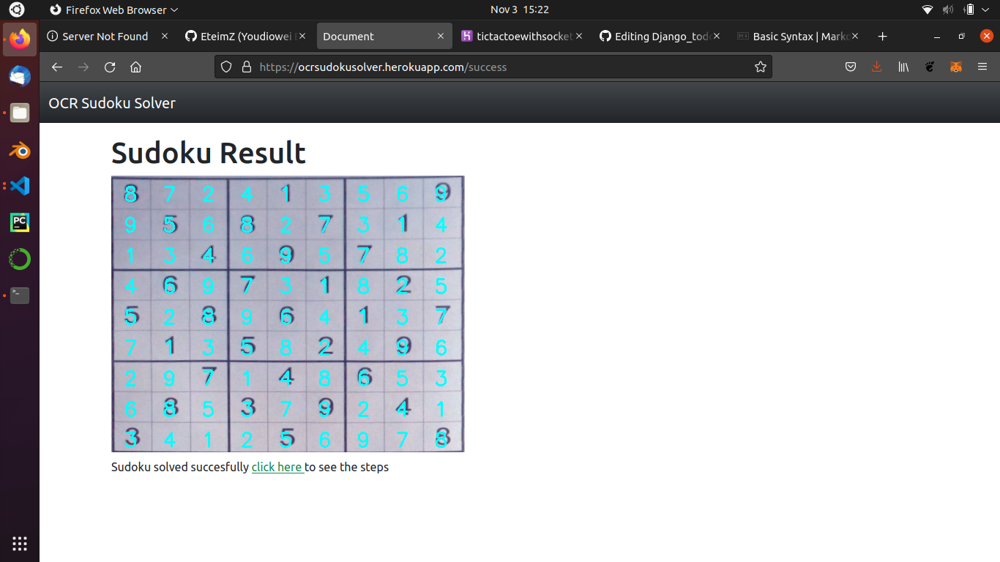
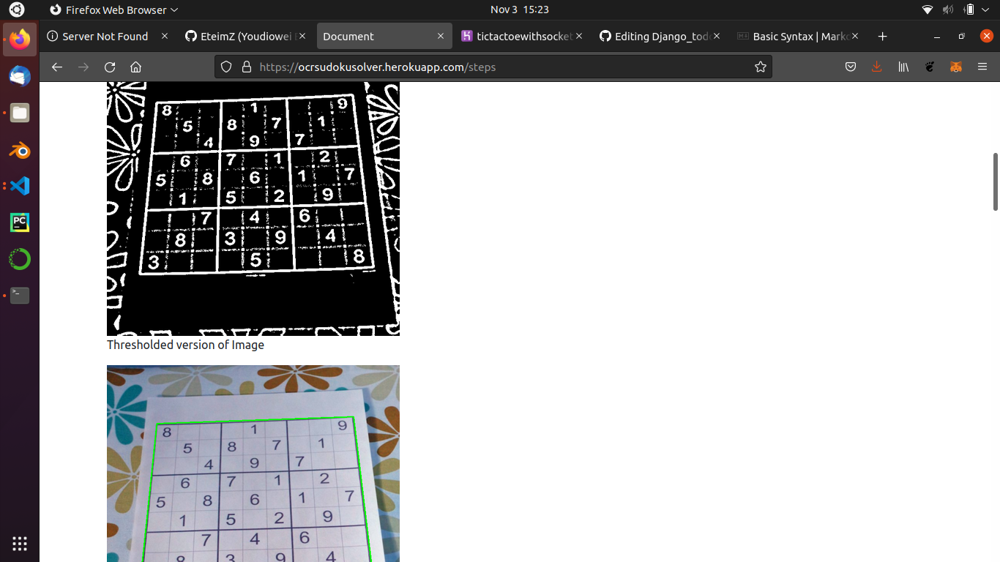

# OCR Sudoku solver 

A Sudoku solver web app built with flask and tensorflow.

# Usage

Deployed [here](https://ocrsudokusolver.herokuapp.com/) on heroku.

## steps

Upload sudoku image and click predict then wait for result.



Sudoku result will be outputed either correct or incorrect



You can get the steps taken by the model by clicking the *click here* link.



## Run locally

Clone github repo:

```bash
git clone https://github.com/EteimZ/OCR_Sudoku_Solver.git
```
Create virtual environment and install required libaries:

```bash
cd OCR_Sudoku_Solver
python -m venv env
pip install -r requirement.t
```

Run wsgi file:
```bash
# Deployed at localhost:5000/
python wsgi.py
```

# Technology
- OCR model was built **Tensorflow**.
- Image processing was done with **opencv**.
- [**Py-sudoku**](https://pypi.org/project/py-sudoku/) is used to solve the sudoku game.
- Web framework is **flask**.

# Resources
Sudoku solver [article](https://www.pyimagesearch.com/2020/08/10/opencv-sudoku-solver-and-ocr/) by  Adrian Rosebrock  on [Pyimagesearch](https://www.pyimagesearch.com/)
